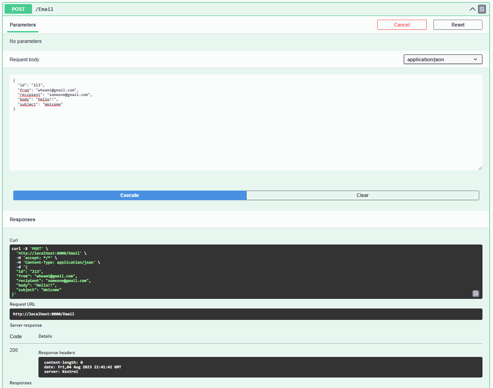
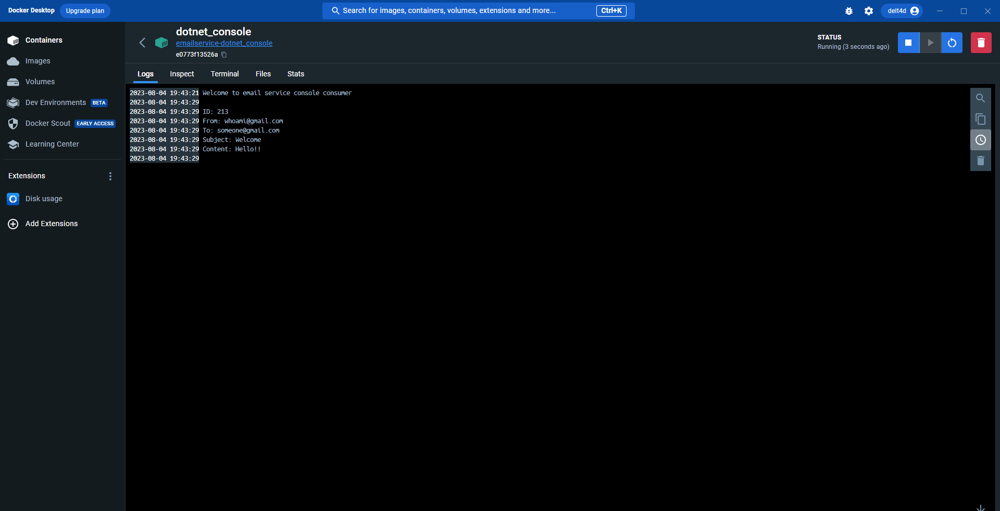
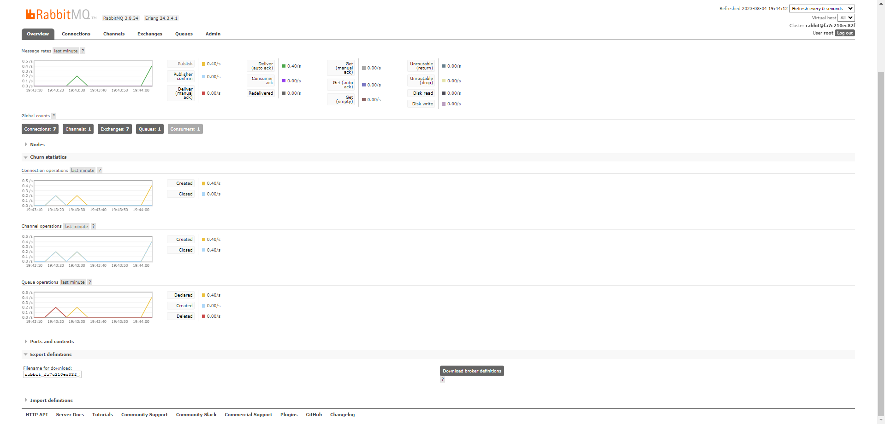

# Email Service with RabbitMQ and Docker

Inside project folder, open terminal and execute ```docker-compose up -d --build```. 

- Docker must be installed and started.
- RabbitMQ management will run on port 15672 and 5672.
- Swagger API endpoint will run on port 8000.
- To see the console c# application consumer logs, open Docker console.



